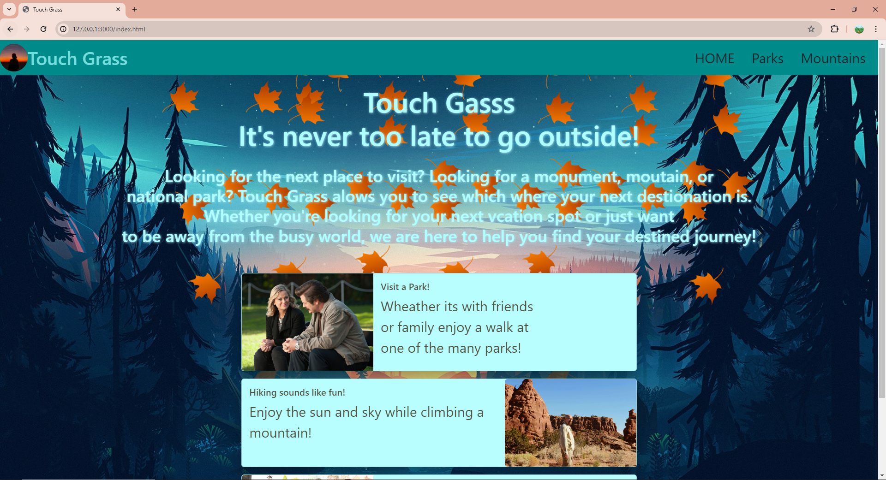
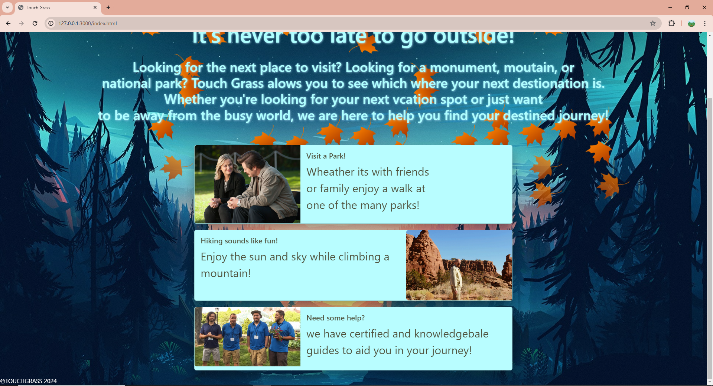
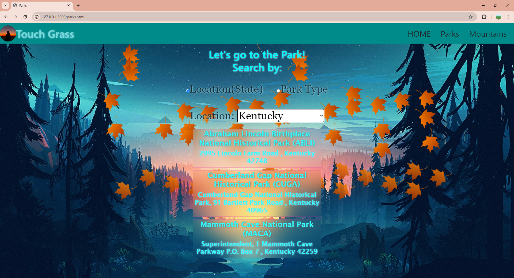
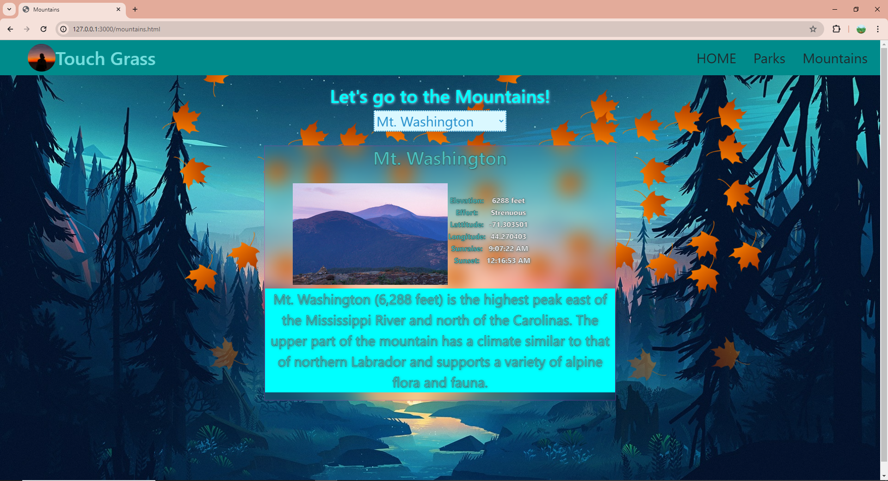

# Capstone2

##Home Page
Using bootrap I was ablw to make cards and make the navigation bar accordingly. 

##Parks Page
Here we have a radio and select options. Using CSS I was able to sperate and design the option results. 
Using Javascript I was able to make a function that when an option is selected (location vs park type) it will make the other option disapear. 

##Mountain Page 
Using Float in my mountains.css allowed me to be able to place the image of the mountain next to it's information.
Withing in my Javascript for mountains.js, I was able to make a little table to display certain information regarding the mountain selected. 

